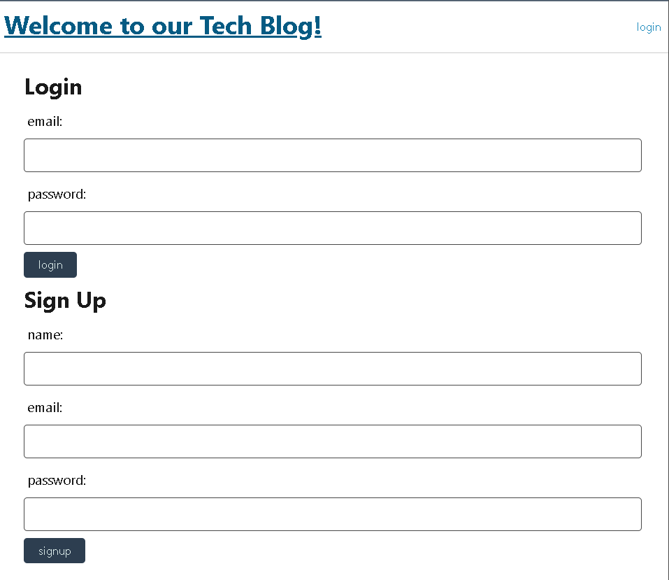
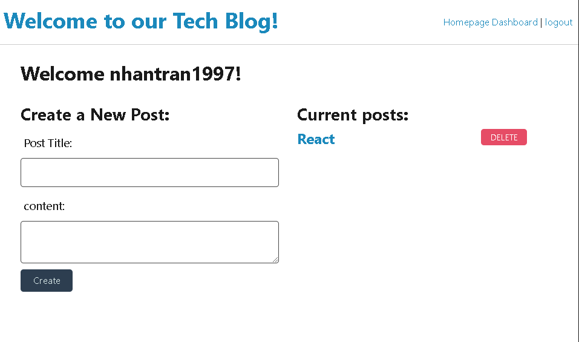

# Blog-Me

## Description
The motivation for this project isa to create a tech blog where users can publish their posts and share comments with other developers. Application used Handlebars and Sequelize as the ORM, and other expression packages for authentication. This project is a great practice to get familiar with using handlebars and database. 

## Table of Contents

- [Description](#description)
- [Credits](#credits)
- [Links](#link)
- [Installation](#installation)
- [Usage](#usage)

## Installation 
<li> Create a new repository on Github and clone it to a local folder
<li> Install the necessary packages by running command "npm i"
<li> Once all packages are installed, run command "node server.js" to test application in Live Server at localhost:3001

## Link

## Usage
<li> Homepage will display some recently added posts by other developers
 

 
<li> New users will need to sign up by fiilling out the form in order to post a blog 
 

 
<li> Logged in users can now post and view their posted blogs!
 

 

## Credits

My private tutor  
Nathan